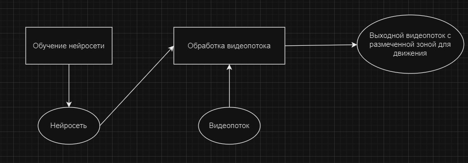

# Алгоритм отрисовки зоны для движения
Этот алгоритм описывает как из кадра видеопотока строиться зона для движения.
## Оглавление
- [Концептуальное описание](#общее)
- [1. Сегментация кадра](#сегментация)
- [2. Тепловая карта](#heatmap)
- [3. Зона для движения](#зона)

## Концептуальное описание
Вся система состоит из следующих частей:
1) Модуль обучения нейронной сети (data_preprocessing.py). Занимается предобработкой данных, созданием, настройкой и обучением нейронной сети для сегментации. Модуль настроен на создание и обучение нейронной сети U-net.
2) Нейронная сеть. Подходит любая нейронная сеть которая может выполнить многоклассовую попиксельную сегментацию входного кадра (т.е. используемая нейронная сеть не обязательно должна являться результатом работы модуля обучения нейронной сети (data_preprocessing.py)).
3) Входной видеопоток. Представляет собой любое видео, будь то записанное в формате, например, mp4 или потоковое. Поддерживается любое разрешение и любая частота кадров.
4) Обработчик видео потока (video_process.py). Принимает на вход нейросеть для сегментации и само видео. Покадрово обрабатывает входной видеопоток и на выходе даёт выходной видеопоток с размеченной зоной для движения автомобиля.

Суть работы заключается в загрузке нейросети для сегментации. Захвата кадра видеопотока и его обработки.
Обработка видео заключается в последовательном выполнении 3 преобразований над кадром входного видеопотока:
1) Сегментация кадра
2) Создание тепловой карты (Heatmap)
3) Создание зоны для движения
   
## 1. Сегментация кадра

1) Захват кадра осуществляется при помощи библиотеки OpenCV2. Особенность этой бибилотеки в том, что призахвате используется формат кодировки изображений BGR вместо привычного RGB, поэтому, в начале необходимо переводить входные кадры в привычный формат RGB.
`frame = cv2.cvtColor(frame, cv2.COLOR_BGR2RGB)`
2) Разные нейросети обученны под разные размеры изображения, поэтому при необходимости можно сделать ресайз входного кадра.
`frame = cv2.resize(frame, (128, 128))`
3) Для того, чтобы подать кадр на вход нейросети его необходимо преобразовать в массив numpy.
`frame = np.array(frame)`

## 2. Тепловая карта

## 3. Зона для движения
