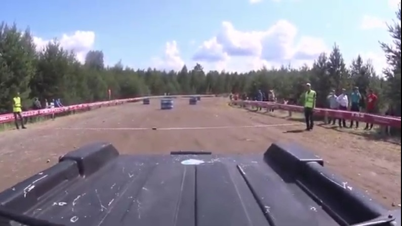
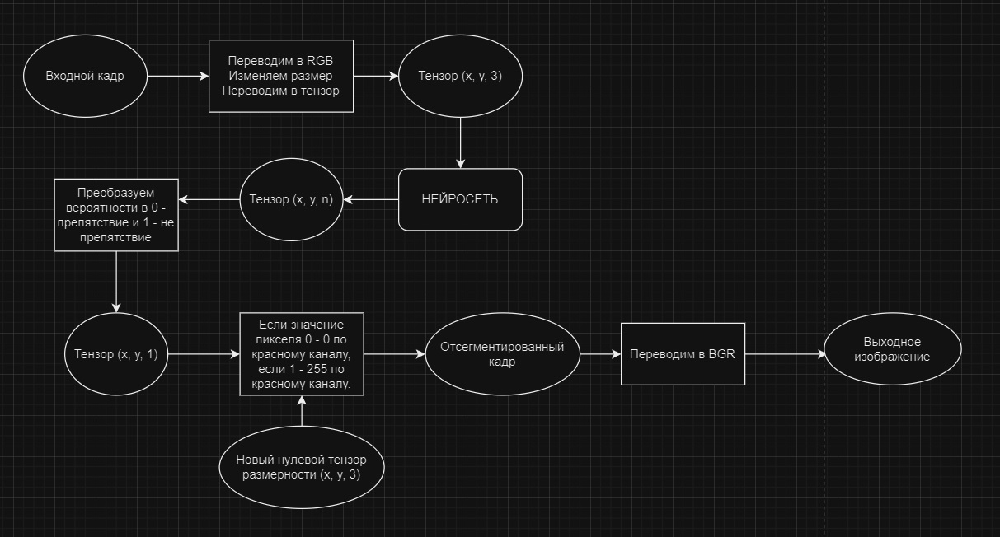
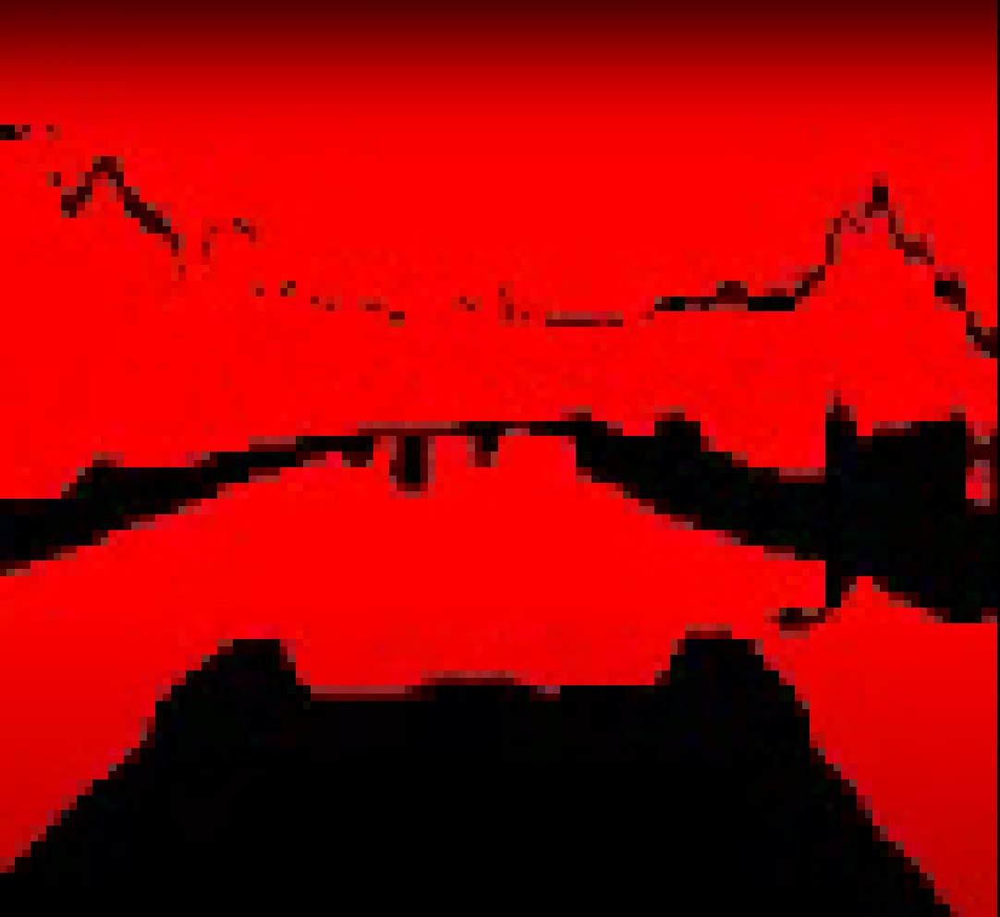
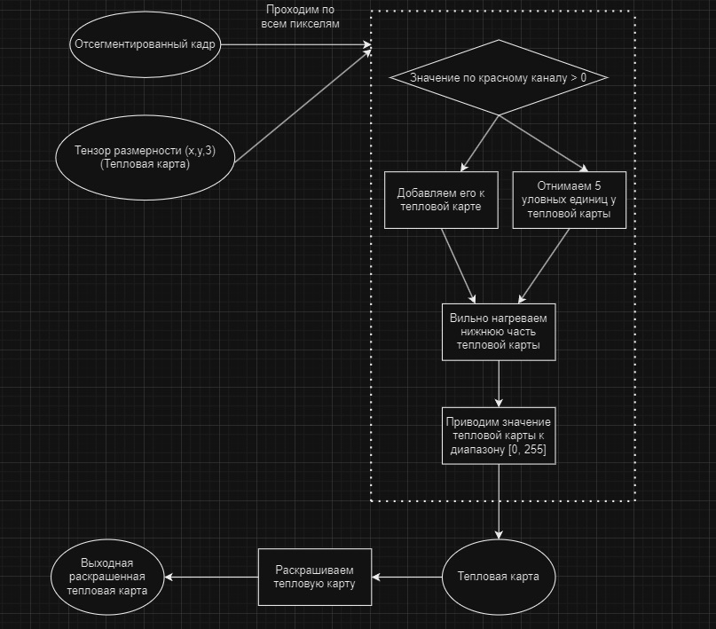
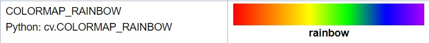

# Алгоритм отрисовки зоны для движения
Этот алгоритм описывает как из кадра видеопотока строиться зона для движения.
## Оглавление
- [Концептуальное описание](#общее)
- [1. Сегментация кадра](#сегментация)
- [2. Тепловая карта](#heatmap)
- [3. Зона для движения](#зона)

## Концептуальное описание
Вся система состоит из следующих частей:
1) Модуль обучения нейронной сети (data_preprocessing.py). Занимается предобработкой данных, созданием, настройкой и обучением нейронной сети для сегментации. Модуль настроен на создание и обучение нейронной сети U-net.
2) Нейронная сеть. Подходит любая нейронная сеть которая может выполнить многоклассовую попиксельную сегментацию входного кадра (т.е. используемая нейронная сеть не обязательно должна являться результатом работы модуля обучения нейронной сети (data_preprocessing.py)).
3) Входной видеопоток. Представляет собой любое видео, будь то записанное в формате, например, mp4 или потоковое. Поддерживается любое разрешение и любая частота кадров.
4) Обработчик видео потока (video_process.py). Принимает на вход нейросеть для сегментации и само видео. Покадрово обрабатывает входной видеопоток и на выходе даёт выходной видеопоток с размеченной зоной для движения автомобиля.


Суть работы заключается в загрузке нейросети для сегментации. Захвата кадра видеопотока и его обработки.
Обработка видео заключается в последовательном выполнении 3 преобразований над кадром входного видеопотока:
1) Сегментация кадра
2) Создание тепловой карты (Heatmap)
3) Создание зоны для движения
   
## 1. Сегментация кадра





1) Захват кадра осуществляется при помощи библиотеки OpenCV2. Особенность этой бибилотеки в том, что призахвате используется формат кодировки изображений BGR вместо привычного RGB, поэтому, в начале необходимо переводить входные кадры в привычный формат RGB.
`frame = cv2.cvtColor(frame, cv2.COLOR_BGR2RGB)`
2) Разные нейросети обученны под разные размеры изображения, поэтому при необходимости можно сделать ресайз входного кадра.
`frame = cv2.resize(frame, (128, 128))`
3) Для того, чтобы подать кадр на вход нейросети его необходимо преобразовать в массив numpy.
`frame = np.array(frame)`
4) Делаем предсказание нейросетью. На выходе получаем список вероятностей принадлежности пикеля классам. Т.е. получаем тензор (128, 128, n), где n - количество классов. Последнее измерение имеет вид: `[n1, n2, ..., nn]`, max(ni) - вероятность класса i в этом пикселе.
`prediction = model.predict(np.expand_dims(frame, 0))`
5) На основе предсказания выбираем самый вероятный класс для каждого пикселя.
`predicted_img = np.argmax(prediction, axis=3)[0,:,:]`
В итоге получаем тензор (128, 128, 1), где последнее измерение отвечает за вероятность того, что пиксель принадлежит ненулевому классу, т.е. не является препятствием.
6) `predicted_img = predicted_img.astype(np.uint8)` - в конце переводим все элементы тензора в 8-битные целые числа без знака. Таким образом, пиксели не являющиеся препятствием примут значение 1, а являющиеся примут значение 0.
7) Создаём новый нулевой тензор, той же размерности, что и входной кадр, чтобы он хранил новый кадр отсегментироавнного изображения.
`segmented_frame = np.zeros_like(frame)`
8) Заполняем канал красного цвета значениями из предсказанной маски predicted_img. Умножение на 255 даст нам интенсивность красного канала от 0 до 255. Таким образом все препятствия имеют интенсивность красного канала равную 0, а остальные объекты равную 255.
`segmented_frame[:, :, 0] = predicted_img * 255`
9) Теперь переводим отсегментированный кадр обратно в BGR, так как OpenCV2 работает с таким форматом.
`segmented_frame = cv2.cvtColor(segmented_frame, cv2.COLOR_RGB2BGR)`
10) Возвращаем отсегментированный кадр.



## 2. Тепловая карта



1) Создаём нулевой тензор, той же размерности, что и отсегментированное изображение, с типом данных элементов `float32`.
(Он будет использоваться для создания тепловой карты).
`heatmap = np.zeros_like(frame[..., 0], dtype=np.float32)`
2) Проходим в 2-ом цикле по всем пикселям изображения.
```
for x in range(frame.shape[0]):
   for y in range(frame.shape[1]):
```
3) Если значение красного канала больше нуля, то добавляем это значение к нашей тепловой карте (нагреваем пиксель).
```
if frame[:,:,2][x][y]>0:
   heatmap[x, y] += frame[:,:,2][x][y]
```
4) Ограничиваем максимальное значение пикселя тепловой карты до 255.
```
if heatmap[x, y] > 255:
   heatmap[x, y] = 255
```
5) Всё, что находится в нижних 37% экрана это часть конструкции машины. Объектами в этой части экрана можно пренебреч. Поэтому мы сильно нагреваем её каждый кадр.
```
elif x>(frame.shape[0]-frame.shape[0]/2.7):
   heatmap[x, y] += 100
```
6) Опять же проверяем, чтобы значение пикселей после этого нагрева было не больше 255.
```
if heatmap[x, y] > 255:
   heatmap[x, y] = 255
```
7) Все остальные части экрана охлаждаются каждый кадр на 5 условных единиц.
```
else:
   heatmap[x, y] -= 5
```
8) Не допускаем, чтобы значения пикселей опускались ниже 0.
```
if heatmap[x, y] < 0:
   heatmap[x, y] = 0
```
9) Применяем тепловую карту `cv2.RAINBOW` к тепловой карте. Чем больше значение пикселя тепловой карты, тем с большей вероятностью он не является препятствием и его цвет ближе к холодному синему.
Чем меньше - тем скорее он является препятствием и его цвет ближе к тёплому красному.

`heatmap_colored = cv2.applyColorMap(heatmap.astype(np.uint8), cv2.COLORMAP_RAINBOW)`
10) Возвращаем цветную тепловую карту.
`return heatmap_colored`

## 3. Зона для движения
